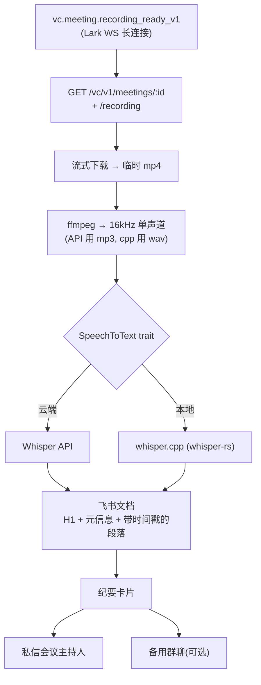

# meeting-digest

> [English](./README.md) · 中文

自动转写飞书/Lark 录制的会议，生成逐字稿文档并推送纪要卡片。



## 流程

1. **事件** — Lark WebSocket 长连接接收 `vc.meeting.recording_ready_v1`。
   仅通过 `/vc/v1/reserves/apply` 预约的会议会触发；即时发起的会议不触发。
2. **拉取** — `GET /vc/v1/meetings/:id`(元信息) + `/recording`(URL)。
3. **下载** — 流式写入临时文件。
4. **转码** — ffmpeg 输出 16kHz 单声道 MP3 (Whisper API) 或 WAV (whisper.cpp)。
5. **转写** — 可插拔 `SpeechToText` trait。
6. **发布** — 在配置的文件夹创建 Docx,私信主持人一张带文档链接的纪要卡片。

## 构建

```bash
# 默认只启用 Whisper API 后端(二进制更小,仅云端)。
cargo build --release

# 启用本地 whisper.cpp(需要 CMake + C++ 工具链)。
cargo build --release --no-default-features --features whisper-cpp
# 两个后端同时可用。
cargo build --release --features whisper-cpp
```

运行时依赖:`ffmpeg` 在 `$PATH` 中(可通过 `DIGEST_FFMPEG` 覆盖)。

## 环境变量

必填:

| 变量 | 用途 |
|---|---|
| `LARK_APP_ID`, `LARK_APP_SECRET` | 机器人凭证 |
| `DIGEST_FOLDER_TOKEN` | 云文档目标文件夹(需与机器人共享,编辑权限) |
| `STT_PROVIDER` | `whisper_api`(默认)或 `whisper_cpp` |
| `STT_WHISPER_API_KEY` | `provider=whisper_api` 时必填 |
| `STT_WHISPER_CPP_MODEL` | `provider=whisper_cpp` 时必填,指向 ggml `.bin` 路径 |

可选:

| 变量 | 默认 | 用途 |
|---|---|---|
| `LARK_BASE_URL` | `https://open.larksuite.com` | 飞书国内版用 `https://open.feishu.cn` |
| `DIGEST_FALLBACK_CHAT_ID` | — | 同时将卡片发送到此群 |
| `DIGEST_WORK_DIR` | `$TMPDIR/meeting-digest` | 临时文件(下载/音频)目录 |
| `DIGEST_FFMPEG` | `ffmpeg` | ffmpeg 可执行路径 |
| `STT_LANGUAGE` | `auto` | BCP-47 语言提示(`zh`、`en`…),加速并提升准确度 |
| `STT_WHISPER_API_BASE` | `https://api.openai.com/v1` | OpenAI 兼容端点 |
| `STT_WHISPER_API_MODEL` | `whisper-1` | 如 `gpt-4o-transcribe` |
| `STT_WHISPER_CPP_THREADS` | 自动(所有核心) | whisper.cpp 线程数 |

## 命令行

```
meeting-digest [COMMAND]

Commands:
  run                                 默认 — 监听 Lark WS,recording_ready_v1 触发处理
  process <MEETING_ID> [--owner ID] [--url URL]
                                      单次处理:对一个 meeting_id 跑完整流程
                                      (用于批量补录或手动测试)
```

示例:

```bash
# 生产:持续监听,并发 2。
meeting-digest run

# 手动处理一场会议,指定私信对象。
meeting-digest process abc123 --owner ou_xxxxxxxx

# 跳过 VC 查询,直接用已知 URL。
meeting-digest process abc123 --url https://.../recording.mp4
```

## 飞书应用配置

1. 在 <https://open.larksuite.com/app> (或 feishu.cn)创建企业自建应用。
2. 启用 **机器人** 能力。
3. 申请权限:
   - `vc:meeting:readonly`、`vc:record:readonly`
   - `im:message:send_as_bot`
   - `docx:document`
   - `drive:drive:readonly`
4. **事件订阅 → 长连接(WebSocket)**,订阅 `vc.meeting.recording_ready_v1`。
5. 发布应用(企业自建应用需管理员审批)。
6. 在云文档创建一个文件夹 → 分享给机器人并授予 **编辑** 权限 →
   从 URL 复制文件夹 token,填入 `DIGEST_FOLDER_TOKEN`。

## STT 扩展点

`stt::SpeechToText` 是扩展接口:

```rust
#[async_trait]
pub trait SpeechToText: Send + Sync {
    async fn transcribe(&self, input: &Path, opts: &TranscribeOptions)
        -> Result<Transcript, SttError>;
    fn name(&self) -> &'static str;
}
```

内置实现:

- **`whisper_api`** — OpenAI 兼容的 `/audio/transcriptions`
  (`verbose_json` 返回带时间戳的段落)。客户端强制 25 MB 上传上限。
- **`whisper_cpp`** — `whisper-rs` 绑定,包在 `spawn_blocking` 中执行,
  直接消费流程生成的 16kHz 单声道 WAV。

新增后端:实现 trait 并在 `stt::build` 中注册即可。

## 已知限制

- **仅限预约会议**。`recording_ready_v1` 只对通过 Reserve API 预约的会议触发。
  其它会议请用 `process <meeting_id>` 手动补录。
- **无说话人分离**。Whisper(API 或 cpp)都不标注发言人。
  如需分离可追加 pyannote / diart 做独立处理。
- **Whisper API 25 MB 上限**。16kHz 单声道 64 kbit MP3 约对应 50 分钟,
  超过需要分片 —— 当前未实现。
- **无官方纪要接口**。飞书妙记 Open API 仅暴露元信息和媒体下载,
  不导出逐字稿,所以我们自己跑 STT。

## 代码结构

```
src/
├── config.rs                 figment 环境变量配置
├── stt/
│   ├── mod.rs                SpeechToText trait + factory
│   ├── whisper_api.rs        OpenAI 兼容 Whisper
│   └── whisper_cpp.rs        whisper-rs (feature whisper-cpp)
├── lark/
│   ├── card.rs               纪要卡片构建
│   └── docs.rs               逐字稿文档布局
├── audio.rs                  ffmpeg 封装
├── pipeline.rs               端到端编排
├── events.rs                 recording_ready_v1 的 WsEventHandler
└── main.rs                   clap CLI
```

VC / Minutes / IM / Drive / Docx 调用全部在
[`larkoapi`](https://github.com/AprilNEA/larkoapi) ≥ 0.4 里。
