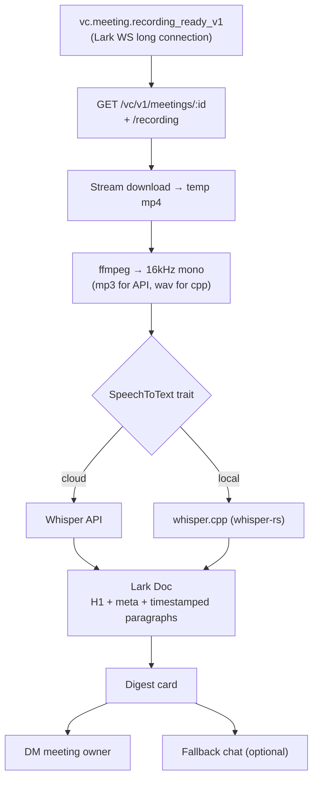

# minutes

> English · [中文](./README_CN.md)

Auto-transcribe Lark/Feishu recorded meetings and post a digest card that
links to a full-text transcript Lark Doc.



## Pipeline

1. **Event** — Lark WebSocket long connection receives
   `vc.meeting.recording_ready_v1`. Only meetings scheduled via
   `/vc/v1/reserves/apply` emit this event; ad-hoc meetings don't.
2. **Fetch** — `GET /vc/v1/meetings/:id` (meta) + `/recording` (URL).
3. **Download** — stream the recording to a temp file.
4. **Transcode** — `ffmpeg` to 16kHz mono MP3 (Whisper API) or WAV (whisper.cpp).
5. **Transcribe** — pluggable `SpeechToText` trait.
6. **Publish** — create a Docx in the configured folder, DM the meeting owner
   a digest card with a link to the doc.

## Build

```bash
# Default: Whisper API backend only (tiny binary, cloud only).
cargo build --release

# With local whisper.cpp (requires CMake + C++ toolchain).
cargo build --release --no-default-features --features whisper-cpp
# Both backends available at runtime.
cargo build --release --features whisper-cpp
```

Runtime prerequisite: `ffmpeg` on `$PATH` (override via `DIGEST_FFMPEG`).

## Environment

Required:

| Var | Purpose |
|---|---|
| `LARK_APP_ID`, `LARK_APP_SECRET` | Bot credentials |
| `DIGEST_FOLDER_TOKEN` | Drive folder (shared with the bot, edit perm) where transcript docs are created |
| `STT_PROVIDER` | `whisper_api` (default) or `whisper_cpp` |
| `STT_WHISPER_API_KEY` | required when `provider=whisper_api` |
| `STT_WHISPER_CPP_MODEL` | path to a ggml `.bin` when `provider=whisper_cpp` |

Optional:

| Var | Default | Purpose |
|---|---|---|
| `LARK_BASE_URL` | `https://open.larksuite.com` | use `https://open.feishu.cn` for China |
| `DIGEST_FALLBACK_CHAT_ID` | — | also post the card to this chat |
| `DIGEST_WORK_DIR` | `$TMPDIR/minutes` | scratch dir for downloads + audio |
| `DIGEST_FFMPEG` | `ffmpeg` | binary path |
| `STT_LANGUAGE` | `auto` | BCP-47 (`zh`, `en`, …) — speeds up + improves STT |
| `STT_WHISPER_API_BASE` | `https://api.openai.com/v1` | OpenAI-compatible host |
| `STT_WHISPER_API_MODEL` | `whisper-1` | e.g. `gpt-4o-transcribe` |
| `STT_WHISPER_CPP_THREADS` | auto (all cores) | thread count for whisper.cpp |

## CLI

```
minutes [COMMAND]

Commands:
  run                                 default — listen on Lark WS, digest on recording_ready_v1
  process <MEETING_ID> [--owner ID] [--url URL]
                                      one-shot: run pipeline for a single meeting
                                      (backfill / manual test)
```

Examples:

```bash
# Production: listen forever, concurrency 2.
minutes run

# Process one meeting, override DM recipient.
minutes process abc123 --owner ou_xxxxxxxx

# Skip VC lookup (useful when you already have a recording URL).
minutes process abc123 --url https://.../recording.mp4
```

## Lark app setup

1. Create a custom app at <https://open.larksuite.com/app> (or feishu.cn).
2. Enable **Bot** capability.
3. Grant scopes:
   - `vc:meeting:readonly`, `vc:record:readonly`
   - `im:message:send_as_bot`
   - `docx:document`
   - `drive:drive:readonly`
4. **Event subscriptions → Long Connection (WebSocket)**.
   Subscribe to `vc.meeting.recording_ready_v1`.
5. Release the app (admin approval for tenant apps).
6. Create a Drive folder, share it with the bot as **Edit**, copy the folder
   token from the URL → `DIGEST_FOLDER_TOKEN`.

## STT abstraction

`stt::SpeechToText` is the extension point:

```rust
#[async_trait]
pub trait SpeechToText: Send + Sync {
    async fn transcribe(&self, input: &Path, opts: &TranscribeOptions)
        -> Result<Transcript, SttError>;
    fn name(&self) -> &'static str;
}
```

Bundled implementations:

- **`whisper_api`** — OpenAI-compatible `/audio/transcriptions` (`verbose_json`
  with segment timestamps). 25 MB upload cap enforced client-side.
- **`whisper_cpp`** — `whisper-rs` bindings; runs inside `spawn_blocking`.
  Consumes the 16kHz mono WAV produced by the pipeline.

Add another backend by implementing the trait and wiring it in `stt::build`.

## Known limits

- **Scheduled meetings only.** `recording_ready_v1` fires only for meetings
  scheduled via the Reserve API. For backfill, invoke `process <meeting_id>`.
- **No speaker diarization.** Whisper (API or cpp) doesn't label speakers.
  Plug a diarizer (pyannote / diart) as a separate pass if you need it.
- **Whisper API 25 MB cap.** ~50 min at 16kHz mono 64kbit MP3. Beyond that,
  chunking is required — not implemented yet.
- **No Minutes transcript export.** Lark's official Minutes Open API exposes
  only metadata + media download, not transcript text. That's why we STT the
  audio ourselves.

## Layout

```
src/
├── config.rs                 figment env config
├── stt/
│   ├── mod.rs                SpeechToText trait + factory
│   ├── whisper_api.rs        OpenAI-compatible Whisper
│   └── whisper_cpp.rs        whisper-rs (feature whisper-cpp)
├── lark/
│   ├── card.rs               digest card builder
│   └── docs.rs                 transcript doc layout
├── audio.rs                  ffmpeg wrapper
├── pipeline.rs               end-to-end orchestrator
├── events.rs                 WsEventHandler for recording_ready_v1
└── main.rs                   clap CLI
```

VC / Minutes / IM / Drive / Docx calls live in
[`larkoapi`](https://github.com/AprilNEA/larkoapi) (≥ 0.4).
